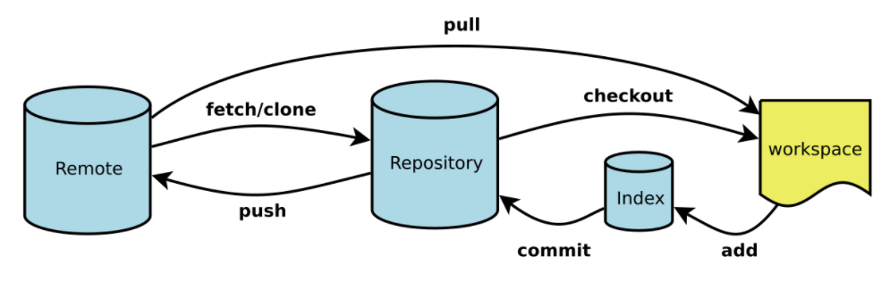

# Git 初识

## 关于本版本控制

版本控制是一种记录文件内容变化, 以便将来查阅特定版本修订情况的系统.

可以对任何类型的文件进行版本控制

优点:

- 实现跨区域多人协同开发
- 追踪和记录文件的历史修改纪律
- 组织和保护源文件
- 统计工作量
- 并行开发

简单来说就是管理多人协同开发项目的技术

## 分布式版本控制器

> Git 是使用最广泛的分布式版本控制器

当前库的所有版本信息全部同步到本地, 这样就可以在本地查看所有版本历史. 可以离线在本地开发, 提交, 只需要在联网的时候 push 到对应服务器就可以.

## git 理论基础

## Git 文件状态

对于任何一个文件, Git 内都只有三种状态: 已提交(committed), 已修改(modified), 已暂存(staged).

已提交表示该文件已经被安全地保存在本地数据库中了；已修改表示修改了某个文件，但还没有提交保存；已暂存表示把已修改的文件放在下次提交时要保存的清单中。

## Git 分支

> Git 中的分支，其实本质上仅仅是个指向 commit 对象的可变指针

Git 是如何知道你当前在哪个分支上工作的呢？其实答案也很简单，它保存着一个名为 HEAD 的特别指针。请注意它和你熟知的许多其他版本控制系统（比如 Subversion 或 CVS）里的 HEAD 概念大不相同。在 Git 中，它是一个指向你正在工作中的本地分支的指针（译注：将 HEAD 想象为当前分支的别名。）

通过 `git checkout name` 就可以将 HEAD 指向指定分支

Git 的实现与项目复杂度无关，它永远可以在几毫秒的时间内完成分支的创建和切换。同时，因为每次提交时都记录了祖先信息（译注：即 parent 对象），将来要合并分支时，寻找恰当的合并基础（译注：即共同祖先）的工作其实已经自然而然地摆在那里了，所以实现起来非常容易。Git 鼓励开发者频繁使用分支，正是因为有着这些特性作保障

