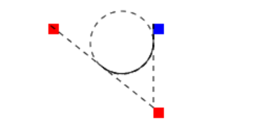

# 绘制形状

## 矩形

> x, y 都是相对于 canvas 起始点; width, height 是形状宽高

- fillRect(x, y, width, height) 绘制填充矩形
  - 可以使用 filleStyle 来定义填充颜色
  ```js
  ctx.fillStyle = 'green';
  ctx.fillRect(20, 10, 150, 100);
  ```
- strokeRect(x, y, width, height) 绘制矩形边框
  - 可以使用以下属性来控制边框样式
  ```js
  ctx.shadowColor = '#d53';
  ctx.shadowBlur = 20;
  ctx.lineJoin = 'bevel';
  ctx.lineWidth = 15;
  ctx.strokeStyle = '#38f';
  ctx.strokeRect(30, 30, 160, 90);
  ```
  - 这个方法是 `rect` 和`stoke` 的结合
- clearRect(x, y, width, height) 清楚指定矩形区域
  - 可以使用此方法来清除整个画布
  ```js
  ctx.clearRect(0, 0, canvas.width, canvas.height);
  ```

```js
function draw() {
  var canvas = document.getElementById('canvas');
  if (canvas.getContext) {
    var ctx = canvas.getContext('2d');

    ctx.fillRect(25, 25, 100, 100);
    ctx.clearRect(45, 45, 60, 60);
    ctx.strokeRect(50, 50, 50, 50);
  }
}
```

## 绘制路径

图形的基本元素是路径。路径是通过不同颜色和宽度的线段或曲线相连形成的不同形状的点的集合。一个路径，甚至一个子路径，都是闭合的。

1. 首先, 需要创建路径起始点
2. 然后需用画图命令画出路径
3. 之后把路径闭合
4. 一旦路径生成, 就能通过描边或填充来渲染图形

- beginPath() 新建一条路径,生成之后，图形绘制命令被指向到路径上生成路径。
- closePath() 闭合路径, 图形绘制命令又重新指向到上下文中。
- stroke() 通过线条来绘制图形轮廓
  - 根据当前的画线样式，绘制当前或已经存在的路径的方法。
- fill() 通过填充来生成实心的图形
  - fillRule
    - 非零环绕规则 'nonzero' 默认
    - 奇偶环绕规则 'evenodd`

> 注意：当前路径为空，即调用 beginPath()之后，或者 canvas 刚建的时候，第一条路径构造命令通常被视为是 moveTo（），无论实际上是什么。出于这个原因，你几乎总是要在设置路径之后专门指定你的起始位置。

> 通常会使用 moveTo()函数设置起点。我们也能够使用 moveTo()绘制一些不连续的路径。

**绘制三角形**

```js
ctx.beginPath();
/* moveTo 可以用于移动画笔起始点 */
ctx.moveTo(10, 50);
/* 注意: 画笔的起始点变为 100, 75 */
ctx.lineTo(100, 75);
ctx.lineTo(100, 25);
ctx.fill();
```

**画线条方法**

- lineTo(x, y)
  - x: 直线终点的 X 轴坐标
  - y: 直线终点的 Y 轴坐标
- arc(x, y, radius, startAngle, endAngle, anticlockwise) 绘制圆弧路径
  - x, y: 圆心位置
  - startAngle, endAngle: 圆弧起点和终点(弧度表示) (x 轴方向开始计算)
  - anticlockwise: 是否逆时针绘制
- arcTo(x1, y1, x2, y2, radius)
  - 根据当前起止点与(x1,y1)的直线 和 (x1, y1)与(x2, y2) 的直线, 作为使用指定半径的圆的切线，画出两条切线之间的弧线路径。(两条直线之间画圆所得到的圆弧(半圆弧))
    

**二次赛贝尔曲线和三次赛贝尔曲线**

- quadraticCurveTo(cp1x, cp1y, x, y) 二次赛贝尔曲线
  - (cp1x, cp1y) 是控制点坐标
  - (x, y) 是曲线终点坐标
- bezierCurveTo(cp1x, cp1y, cp2x, cp2y, x, y) 三次赛贝尔曲线
  - 有两个控制点

## Path2D 对象

为了简化重复的绘制指令, Path2D 对象可以用来缓存或记录绘画命令

所有的绘制路径的方法, 都可以在 Path2D 中使用

```js
let ctx = document.querySelector('canvas').getContext('2d');

let rect = new Path2D();
rect.rect(0, 0, 50, 50);
ctx.stroke(rect);

let circle = new Path2D();
// circle.moveTo(115, 25)
circle.arc(90, 25, 25, 0, Math.PI * 2);

ctx.fill(circle);
```

并且, Path2D 可以直接使用 SVG paths.

> 有个问题, 没有设定 svg 图标的起始位置


