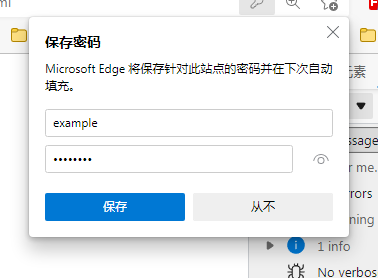
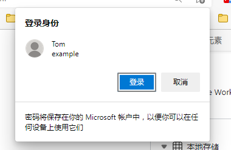
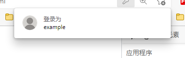

# 凭证管理 API

简单来说就是提供了一个在客户端存储私密信息的 API

> 这个 API 只能用于安全上下文

下辖三个子类

- PasswordCredential 用户名和密码
- PublicKeyCredential 公钥
- FederatedCredential 联邦身份

## PasswordCredential

```js
let pwdCredential = new PasswordCredential({
  id: 'example',
  name: 'Tom',
  password: 'HYL123lh',
  // iconURL: 用户头像
});

// 浏览器将会弹出一个框框, 提示保存密码
navigator.credentials
  .store(pwdCredential)
  .then((creds) => {
    // 保存成功
  })
  .catch((err) => {
    console.log(err);
  });
```



使用保存的用户登录

```js
navigator.credentials
  .get({
    password: true,
  })
  .then((creds) => {
    console.log(creds); // 这里会返回存储的密码信息
    // 如果用户选择取消, 这个会是 null
  });
```
1. 首先可能会弹出这么一个窗口(如果之前没登录)

    

2. 然后会再弹出一个窗口


    


之后每次调用都会弹出第二个窗口


### 如何退出登录

退出登录的时候使用
```js
 navigator.credentials.preventSilentAccess()
 // 这会阻止用户自动登录, 在你下次调用登录的时候, 会弹出确定登录窗口(登录身份窗口)
```

> 这个东西不能让你真正登录, 他只是保存你的密码, 并且给你提示

> chrome 和 firefox 似乎支持不友好....