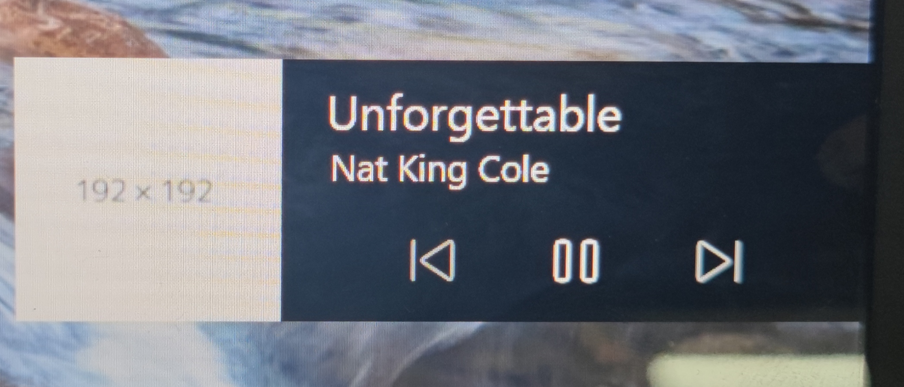

# 媒体会话接口

媒体会话 API 提供了一种自定义媒体通知的方法。它通过提供元数据来执行此操作，以便用户代理为 Web 应用正在播放的媒体显示。

一个类似的可能应用是(如果网页在播放音乐或者视频, 系统锁屏了, 那么会在锁屏界面显示一个类似音乐播放的小组件)



```js
if ('mediaSession' in navigator) {
  navigator.mediaSession.metadata = new MediaMetadata({
    title: 'Unforgettable',
    artist: 'Nat King Cole',
    album: 'The Ultimate Collection (Remastered)',
    artwork: [
      {
        src: 'https://dummyimage.com/96x96',
        sizes: '96x96',
        type: 'image/png',
      },
      {
        src: 'https://dummyimage.com/128x128',
        sizes: '128x128',
        type: 'image/png',
      },
      {
        src: 'https://dummyimage.com/192x192',
        sizes: '192x192',
        type: 'image/png',
      },
      {
        src: 'https://dummyimage.com/256x256',
        sizes: '256x256',
        type: 'image/png',
      },
      {
        src: 'https://dummyimage.com/384x384',
        sizes: '384x384',
        type: 'image/png',
      },
      {
        src: 'https://dummyimage.com/512x512',
        sizes: '512x512',
        type: 'image/png',
      },
    ],
  });
}
```

## 事件

```js
navigator.mediaSession.setActionHandler('play', function () {
  /* Code excerpted. */
});
navigator.mediaSession.setActionHandler('pause', function () {
  /* Code excerpted. */
});
navigator.mediaSession.setActionHandler('stop', function () {
  /* Code excerpted. */
});
navigator.mediaSession.setActionHandler('seekbackward', function () {
  /* Code excerpted. */
});
navigator.mediaSession.setActionHandler('seekforward', function () {
  /* Code excerpted. */
});
navigator.mediaSession.setActionHandler('seekto', function () {
  /* Code excerpted. */
});
navigator.mediaSession.setActionHandler('previoustrack', function () {
  /* Code excerpted. */
});
navigator.mediaSession.setActionHandler('nexttrack', function () {
  /* Code excerpted. */
});

/* 这个事件目前在任何浏览器中都无效 */
navigator.mediaSession.setActionHandler('skipad', function () {
  /* Code excerpted. */
});
```
