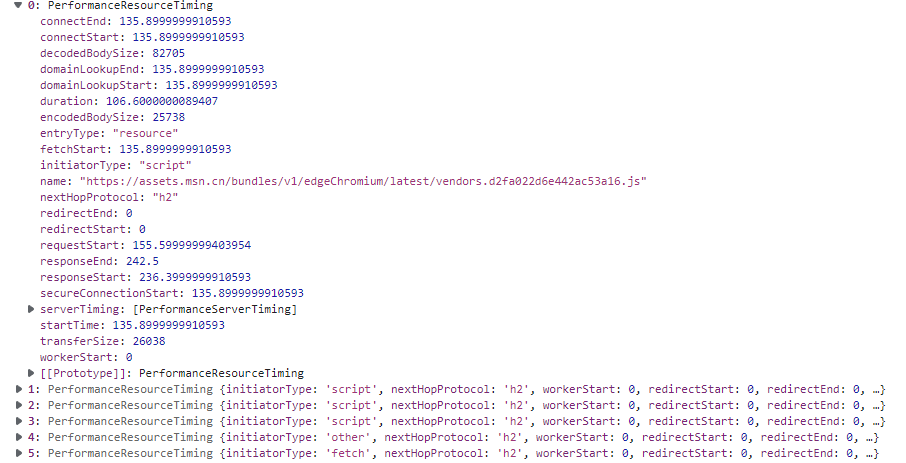
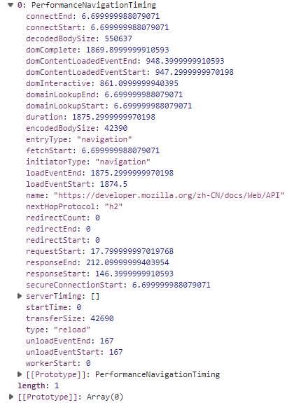
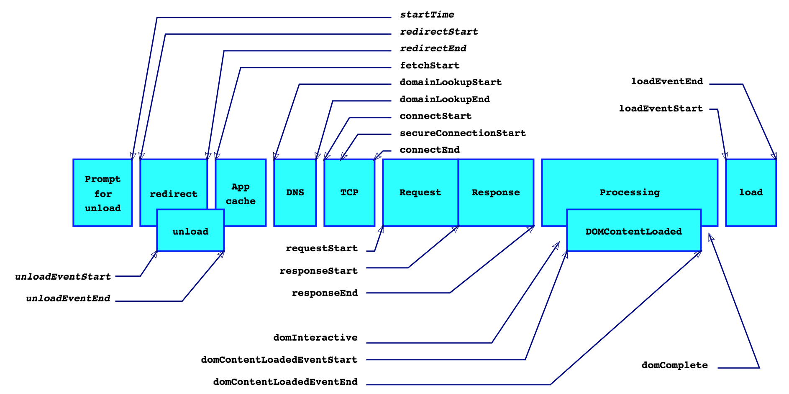

# PerformanceTimeline

`性能时间轴`API 是对 Performance API 的扩展

能够获取各种资源的纤细加载时间, 包括 页面的渲染时间, 接口的详细请求事件等

- getEntries() 返回指定名称或类型的条目
- getEntriesByName()
- getEntriesByType()
  - mark
  - measure
  - navigation
  - frame
  - resource
  - server

## 使用

### resource timeline

> 返回所有资源的请求时间

```js
performance.getEntriesByType('resource');
```



这个图说明这些信息的含义


### navigation timeline

> 返回文档的加载到 load 的时间

```js
performance.getEntriesByType('navigation');
```





### mark

> 这是用于自定的 timeline, 允许用户设置标识来记录时间

```js
performance.mark('startTask');

performance.mark('endTask');

performance.getEntriesByType('mark'); // 通过这个获取所有的mark

// Use getEntries(name, entryType) to get specific entries
p = performance.getEntries({ name: 'startTask', entryType: 'mark' });
```

### measure

> 这也是一个用户自定义的 timeline, 它能够测量两个 mark 之间的时间

```js
performance.measure(name, startMark, endMark);

/* 获取 */
performance.getEntriesByType('measure');

performance.getEntriesByName('name');

/* 清除 */
performance.clearMeasures();
```


