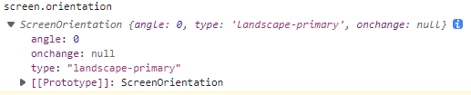

# 屏幕方向 API

此 API 可以获取屏幕的方向信息

通过 `screen.orientation` 访问 `ScreenOrientation` 实例

## 属性

- type 返回屏幕的当前方向类型
  - 'portrait' 开头表示纵向
  - 'landscape' 开头表示横向
- angle 返回屏幕旋转角度
- onchange 屏幕方向变化时触发

## 方法

> 目前方法无效

- lock() 传入屏幕方向类型, 用于锁定文档的显示方向
- unlock()
