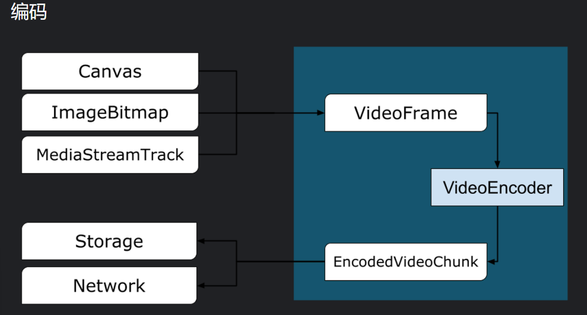
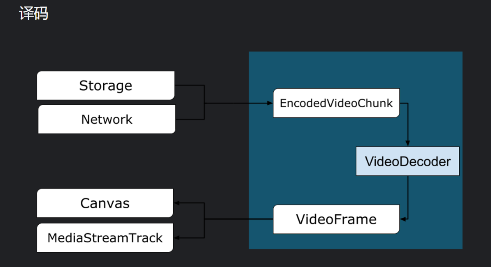

# 使用 webCodecs

> 仅在安全上下文可用

## 视频处理工作流程

帧是视频处理的核心.

视频编码器将帧转换为编码块, 视频解码器的作用恰恰相反.

> 可以从画布，位图，视频元素和其他视频帧构建

### 编码



有三种方法可以构造视频帧

- 从画布, 图像位图或视频元素等图像源

  ```js
  const canvas = document.createElement('canvas');
  const frameFromCanvas = new VideoFrame(canvas, { timestamp: 0 });
  ```

- 从媒体流中提取帧

  ```js
  const stream = await navigator.mediaDevices.getUserMedia({…});
  const track = stream.getTracks()[0];

  const trackProcessor = new MediaStreamTrackProcessor(track);

  const reader = trackProcessor.readable.getReader();
  while (true) {
    const result = await reader.read();
    if (result.done) break;
    const frameFromCamera = result.value;
  }
  ```

- 从 BufferSource 中的二进制像素表示形式创建帧
  ```js
  const pixelSize = 4;
  const init = {
    timestamp: 0,
    codedWidth: 320,
    codedHeight: 200,
    format: 'RGBA',
  };
  const data = new Uint8Array(init.codedWidth * init.codedHeight * pixelSize);
  for (let x = 0; x < init.codedWidth; x++) {
    for (let y = 0; y < init.codedHeight; y++) {
      const offset = (y * init.codedWidth + x) * pixelSize;
      data[offset] = 0x7f; // Red
      data[offset + 1] = 0xff; // Green
      data[offset + 2] = 0xd4; // Blue
      data[offset + 3] = 0x0ff; // Alpha
    }
  }
  const frame = new VideoFrame(data, init);
  ```
  **编码视频帧**
  在编码之前需要给出两个 JS 对象:

* 具有两个函数的初始化对象, 用于处理编码的块和错误.(定义后无法修改)
* 编码器配置对象(可以在之后通过 `configure()`修改)

```js
const init = {
  output: handleChunk,
  error: (e) => {
    console.log(e.message);
  },
};

const config = {
  codec: 'vp8',
  width: 640,
  height: 480,
  bitrate: 2_000_000, // 2 Mbps
  framerate: 30,
};

const { supported } = await VideoEncoder.isConfigSupported(config);
if (supported) {
  const encoder = new VideoEncoder(init);
  encoder.configure(config);
} else {
  // Try another config.
}
```

设置编码器后, 即可通过方法接受帧. 两者并立即返回，而无需等待实际工作完成。它允许多个帧同时排队等待编码，同时显示队列中有多少请求正在等待以前的编码完成。如果参数或方法调用的顺序违反 API 协定，则立即引发异常，或者针对编解码器实现中遇到的问题调用回调来报告错误。如果编码成功完成，则使用新的编码块作为参数调用回调。此处的另一个重要细节是，当不再需要帧时，需要通过调用来告知帧 。

```js
let frameCounter = 0;

const track = stream.getVideoTracks()[0];
const trackProcessor = new MediaStreamTrackProcessor(track);

const reader = trackProcessor.readable.getReader();
while (true) {
  const result = await reader.read();
  if (result.done) break;

  const frame = result.value;
  if (encoder.encodeQueueSize > 2) {
    // Too many frames in flight, encoder is overwhelmed
    // let's drop this frame.
    frame.close();
  } else {
    frameCounter++;
    const keyframe = frameCounter % 150 == 0;
    encoder.encode(frame, { keyFrame });
    frame.close();
  }
}
```

最后，是时候通过编写一个函数来完成编码代码了，该函数在编码器中输出编码视频块时处理这些视频块。通常，此功能是通过网络发送数据块或将它们多路复用到媒体容器中以进行存储。

```js
function handleChunk(chunk, metadata) {
  if (metadata.decoderConfig) {
    // Decoder needs to be configured (or reconfigured) with new parameters
    // when metadata has a new decoderConfig.
    // Usually it happens in the beginning or when the encoder has a new
    // codec specific binary configuration. (VideoDecoderConfig.description).
    fetch('/upload_extra_data', {
      method: 'POST',
      headers: { 'Content-Type': 'application/octet-stream' },
      body: metadata.decoderConfig.description,
    });
  }

  // actual bytes of encoded data
  const chunkData = new Uint8Array(chunk.byteLength);
  chunk.copyTo(chunkData);

  fetch(`/upload_chunk?timestamp=${chunk.timestamp}&type=${chunk.type}`, {
    method: 'POST',
    headers: { 'Content-Type': 'application/octet-stream' },
    body: chunkData,
  });
}
```

如果在某些时候您需要确保所有挂起的编码请求都已完成，则可以致电并等待其承诺。flush()

`await encoder.flush();`

### 解码



```js
const init = {
  output: handleFrame,
  error: (e) => {
    console.log(e.message);
  },
};

const config = {
  codec: 'vp8',
  codedWidth: 640,
  codedHeight: 480,
};

const { supported } = await VideoDecoder.isConfigSupported(config);
if (supported) {
  const decoder = new VideoDecoder(init);
  decoder.configure(config);
} else {
  // Try another config.
}
```

解码器初始化后，您可以开始向其提供对象。要创建区块，您需要：EncodedVideoChunk

- 编码视频数据的缓冲区源
- 块的开始时间戳（以微秒为单位）（块中第一个编码帧的媒体时间）
- 块的类型，其中之一：
  - key 如果块可以独立于以前的块进行解码
  - delta 如果块只能在解码一个或多个以前的块后解码

此外，编码器发出的任何块都已按原样准备好用于解码器。上面所说的关于错误报告和编码器方法的异步性质的所有内容对于解码器也是如此。

```js
const responses = await downloadVideoChunksFromServer(timestamp);
for (let i = 0; i < responses.length; i++) {
  const chunk = new EncodedVideoChunk({
    timestamp: responses[i].timestamp,
    type: responses[i].key ? 'key' : 'delta',
    data: new Uint8Array(responses[i].body),
  });
  decoder.decode(chunk);
}
await decoder.flush();
```

现在是时候展示如何在页面上显示新解码的帧了。最好确保解码器输出回调 （） 快速返回。在下面的示例中，它仅将一个帧添加到准备呈现的帧队列中。渲染是分开进行的，由两个步骤组成：handleFrame()

- 等待合适的时间显示框架。
- 在画布上绘制框架。

一旦不再需要某个帧，调用以在垃圾回收器到达该帧之前释放基础内存，这将减少 Web 应用程序使用的平均内存量。close()

```js
const canvas = document.getElementById('canvas');
const ctx = canvas.getContext('2d');
let pendingFrames = [];
let underflow = true;
let baseTime = 0;

function handleFrame(frame) {
  pendingFrames.push(frame);
  if (underflow) setTimeout(renderFrame, 0);
}

function calculateTimeUntilNextFrame(timestamp) {
  if (baseTime == 0) baseTime = performance.now();
  let mediaTime = performance.now() - baseTime;
  return Math.max(0, timestamp / 1000 - mediaTime);
}

async function renderFrame() {
  underflow = pendingFrames.length == 0;
  if (underflow) return;

  const frame = pendingFrames.shift();

  // Based on the frame's timestamp calculate how much of real time waiting
  // is needed before showing the next frame.
  const timeUntilNextFrame = calculateTimeUntilNextFrame(frame.timestamp);
  await new Promise((r) => {
    setTimeout(r, timeUntilNextFrame);
  });
  ctx.drawImage(frame, 0, 0);
  frame.close();

  // Immediately schedule rendering of the next frame
  setTimeout(renderFrame, 0);
}
```

## 与 worker 配合

根据设计，WebCodecs API 以异步方式和主线程执行所有繁重的工作。但是，由于帧和块回调通常可以每秒调用多次，因此它们可能会使主线程混乱，从而使网站的响应速度降低。因此，最好将单个帧和编码块的处理移动到 Web 工作线程中。

这点有疑问:
**为了帮助实现这一点，ReadableStream 提供了一种方便的方法，可以自动将来自媒体轨道的所有帧传输到工作线程 ??**

使用 HTMLCanvasElement.transferControlToOffscreen，甚至可以在主线程之外完成渲染。

```

```
