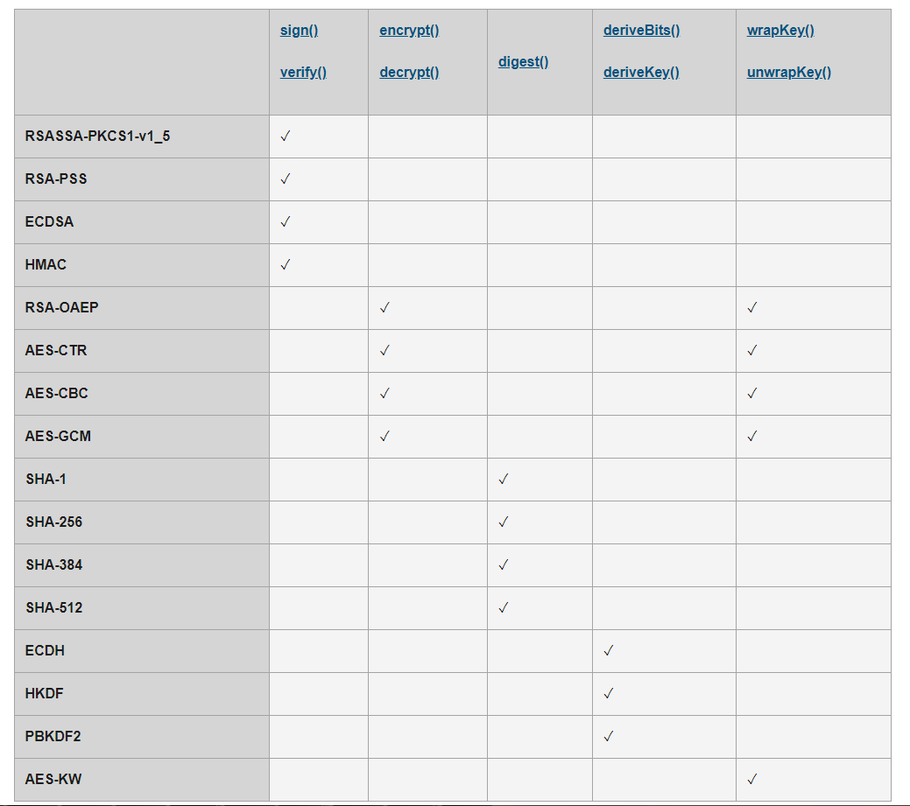

# WebCrypto

这个接口由 `SubtleCrypto` API 定义, 通过 `crypto.subtle` 访问它的实例

## 加密支持

### 数字签名

- sign() 创建数字签名
```js

```

- verify() 验证数字签名

### 加密和解密数据

- encrypt()
- decrypt()

### 消息摘要

- digest()

```js
crypto.subtle.digest('SHA-256', buffer);
```

## 秘钥管理

### 生成和派生秘钥

- generateKey()
- deriveKey()

### 导入和导出秘钥

- importKey()
- exportKey()
- wrapKey()
- unwrapKey()

### 存储秘钥

- 可以通过 web storage API 来存储
- 也可以通过 IndexDB API 来存储

## 支持算法


