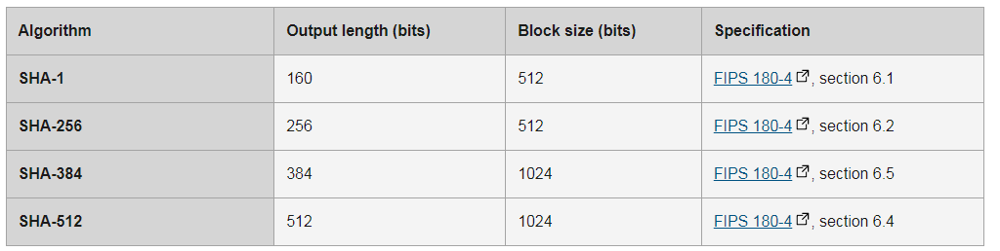

# 信息摘要算法 

又称为 安全散列算法 (Secure Hash Algorithm), 即 SHA 家族

## 使用

```js
const digest = crypto.subtle.digest(algorithm, data);
/* 返回一个promise */
```

+ algorithm: String, 指定摘要算法, 值为以下值之一
  + SHA-1(已经不推荐使用)
  + SHA-256
  + SHA-384
  + SHA-512
+ data: ArrayBuffer || ArrayBufferView





