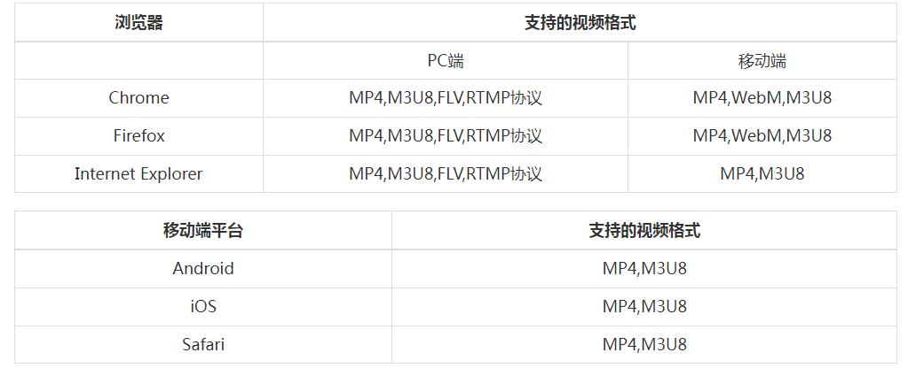

# 流媒体

> 流媒体（streaming media）是指将一连串的媒体数据压缩后，经过网上分段发送数据，在网上即时传输影音以供观赏的一种技术与过程，此技术使得数据包得以像流水一样发送；如果不使用此技术，就必须在使用前下载整个媒体文件。流式传输可传送现场影音或预存于服务器上的影片，当观看者在收看这些影音文件时，影音数据在送达观看者的计算机后立即由特定播放软件播放。

> Internet 是以包传输为基础进行的异步传输，数据被分解成许多包进行传输，由于每个包可能选择不同的路由，所以到达用户计算机的时间延迟就会不同，而在客户端就需要缓存系统来弥补延迟和抖动的影响以及保证数据包传输的顺序。在流媒体文件的播放过程中，由于不再需要把所有的文件都下载到缓存，因此对缓存的要求很低

## 视频流

| 协议    | 传输方式 | 视频封装格式 | 延时 | 数据分段 | HTML5 播放                                        |
| ------- | -------- | ------------ | ---- | -------- | ------------------------------------------------- |
| httpflv | http     | flv          | 低   | 连续流   | 通过 flv.js 实现                                  |
| rtmp    | tcp      | flv tag      | 低   | 连续流   | 不支持                                            |
| hls     | http     | ts 文件      | 高   | 切片文件 | 通过 hls.js 实现                                  |
| dash    | http     | Mp4 3gp webm | 高   | 切片文件 | 如果 dash 文件列表是 mp4, webm 文件, 可以直接播放 |

**兼容性列表(来源 chplayer.com)**


## 主要关注 flv, hls, dash

### flv

FLV 是 FLASH VIDEO 的简称, 也是早期视频网站主要适用的视频格式

早期网站都有 flash 插件, 能够直接播放 flv 视频, 但是现在 flash 已经成为过去

现在要在页面上播放 flv 视频, 需要使用 flv.js 库

**使用 ffmpeg 实现本地直播推流**

```
ffmpeg -re -i flv格式文件 -c copy -f flv rtmp://localhost:1935/live/自定义名字
```

**使用 Node-Media-Server 实现 rtmp 流转 http-flv 流**
[Node-Media-Server](https://github.com/illuspas/Node-Media-Server/blob/master/README_CN.md)

```js
const NodeMediaServer = require('node-media-server');

const config = {
  rtmp: {
    port: 1935,
    chunk_size: 60000,
    gop_cache: true,
    ping: 30,
    ping_timeout: 60,
  },
  http: {
    port: 8000,
    allow_origin: '*',
  },
};

var nms = new NodeMediaServer(config);
nms.run();
```

**使用 flv.js 实现 flv 格式解码**

> 可以播放视频流(顺序流)和直播流(实时流)

原理是使用`fetch` 获取文件流, 然后解码 flv 格式流, 转为浏览器能够播放的流格式(mp4), 在通过 `媒体扩展API` 将流写入`MediaSource`在`video`标签中播放

[flv.js](https://github.com/bilibili/flv.js)

```html
<video id="videoElement" controls></video>
<script>
  if (flvjs.isSupported()) {
    var videoElement = document.getElementById('videoElement');
    var flvPlayer = flvjs.createPlayer({
      type: 'flv',
      url: 'http://localhost:8000/live/test.flv',
    });
    flvPlayer.attachMediaElement(videoElement);
    flvPlayer.load();
    flvPlayer.play();
  }
</script>
```

### hls

HLS 是 HTTP Live Streaming 的缩写, 是苹果公司提出的基于 HTTP 的流媒体网络传输协议

> 这个协议的文件就是 m3u8

HLS 协议规定

- 视频的封装格式是 TS。
- 视频的编码格式为 H264,音频编码格式为 MP3、AAC 或者 AC-3。
- 除了 TS 视频文件本身，还定义了用来控制播放的 m3u8 文件（文本文件）。
  - HLS 的 m3u8，是一个 ts 的列表，也就是告诉浏览器可以播放这些 ts 文件，


