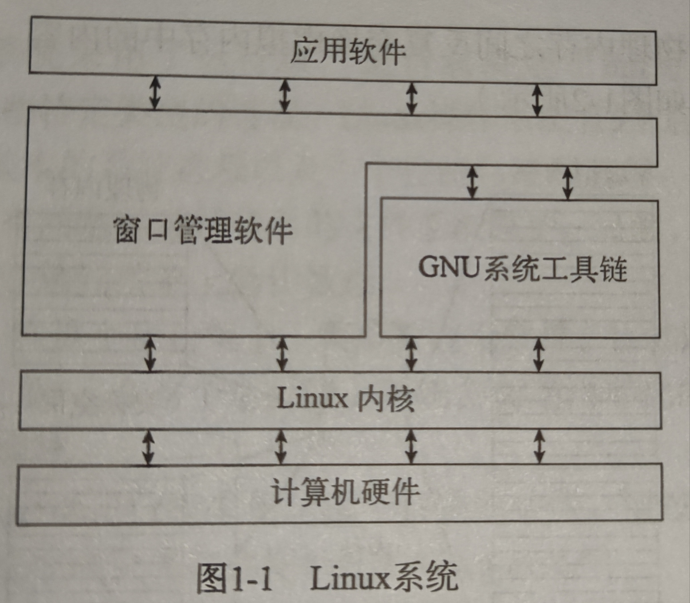

# 初识 Linux

## 什么是 Linux

Linux 可以分为四部分

- Linux 内核
- GNU 工具
- 图形化桌面
- 应用软件

## 深入研究 Linux 内核

Linux 系统的核心是内核

内核主要负责一下四种功能

- 系统内存管理
- 软件程序管理
- 硬件设备管理
- 文件系统管理

### 系统内存管理

交换空间: 内核通过硬盘上的存储空间来实现虚拟内存, 这块区域被称为交换空间

虚拟内存

页面: 内存存储单元按组划分成很多块, 这些块被称为页面

换出:

### 软件程序管理

Linux 操作系统将运行中的程序称为 `进程`

内核创建了第一个进程(称为 init 进程)来启动系统上所有其他进程, 这个表通常位于 `/etc/inittab` 中.

在 Ubuntu 中则采用 `/etc/init.d` 目录, 将开启时启动或停止某个应用的脚本放在这个目录下. 这些脚本通过 `/etc/rcX.d` 目录下的入口启动. 这里 X 表示 `运行级`

- 运行级为 1 时, 只能启动基本的系统进程以及一个控制台终端进程. 称之为`单用户模式`, 通常用于紧急的文件系统维护
- 标准的启动运行级是 3, 大多数应用软件都会启动
- 运行级为 5 时, 系统会启动图形化的程序, 允许用户通过图形化窗口登录系统

### 文件系统管理

Linux 内核支持通过不同类型的文件系统从硬盘中读写数据

常见文件系统

| 文件系统 | 描述                              |
| -------- | --------------------------------- |
| ntfs     | 支持 Microsoft NT 文件系统        |
| nfs      | 网络文件系统                      |
| smb      | 支持网络访问的 Samba SMB 文件系统 |

### GNU 工具

GNU 原本是为 Unix 系统管理员设计出一套类似Unix的环境, 这个目标促使该项目移植了很多常见的 Unix 系统命令行工具

后来Linux 也使用了该工具

该工具核心包括
+ 用以处理文件的工具
+ 用以操作文本的工具
+ 用以管理进程的工具

> 一般我们会看到 系统名称如 Deepin GNU/Linux, 这是为了向GNU组织所作的共享致意 

### shell

GNU/Linux shell 是一种特殊的交互式工具. 它为用户提供了启动程序, 管理文件系统中的文件以及运行在Linux系统上的进程的途径.

shell 核心是命令提示符

## Linux 桌面环境

最常见的就是 GNOME (GNU 网络对象模型) 桌面

## Linux 发行版

### 核心 Linux 发行版

| 发行版  | 描述                                             |
| ------- | ------------------------------------------------ |
| Red Hat | 主要用于 Internet 服务器的商业发行版             |
| Fedora  | 从 Red Hat 分离出的家用发行版                    |
| Gentoo  | 为高级 Linux 用户设计的发行版, 仅包含 Linux 源码 |

### 特定用途的 Linux 发行版

| 发行版      | 描述                                                 |
| ----------- | ---------------------------------------------------- |
| CentOs      | 一个基于 Red Hat 企业版 Linux 源代码构建的免费发行版 |
| Ubuntu      | 一款用于学校和家庭的免费发行版                       |
| Mint        | 一款用于家庭娱乐的免费发行版                         |
| Puppy Linux | 一款用于老旧 Pc 的小型免费发行版                     |
