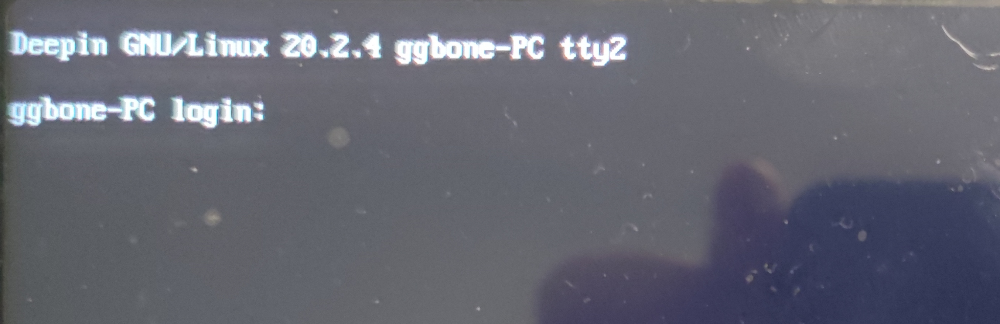

# 走进 Shell

CLI: 文本命令行界面

Linux 控制台: 就是一个简单的 shell CLI

Linux 系统启动后, 它会自动创建出一些虚拟控制台. 大多数 Linux 发行版会启动 5~6 个. 通过 `ctrl + alt + f1 ~ f7` 来访问他们

在 deppIn 中, `ctrl + alt + f1` 没有任何反应, 应该就是当前桌面控制台(图形化终端也可以看做一种 CLI)

## 虚拟控制台

`tty2`: 表示的是这是第二个虚拟控制台

> tty 代表电传打字机, 值的是一台用于发送消息的机器

在 Linux 虚拟控制台中是无法允许任何图形化程序的

### 修改控制台背景

通过 setterm 命令

| 选型           | 参数                                         | 描述                               |
| -------------- | -------------------------------------------- | ---------------------------------- |
| -inversescreen | on 或 off                                    | 交换背景色和前景色                 |
| -background    | black, red, green, yellow, blue, cyan, white | 将终端背景色改为指定颜色           |
| -foreground    | 同 background                                | 将终端前景色(文字颜色)改为指定颜色 |
| -reset         | 无                                           | 回复默认                           |

## 通过图形化终端访问 CLI

这种方式需要安装图形化终端仿真器

+ Xterm 是最古老也是最基础的终端仿真器
+ UXterm 是支持Unicode的Xterm

