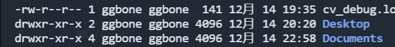

# 基本的 bash shell 命令

## 启动 shell

bash shell 能提供对 Linux 系统的交互式访问. 它是作为普通程序运行的韵, 通常是在用户登录终端时启动. 登录时启动的 shell 依赖于用户账户配置

`/etc/passwd` 文件包含了所有系统用户账户列表及每个用户的基本配置信息.

例如: `christine:x:501:501:Christine Bresnaban:/home/christine:/bin/bash`

christine: 是登录名
x: 不知道
两个 501 分别是 uid 和 gid
Christine Bresnaban: 是用户名
/home/christine: 使用用户目录
/bin/bash: 是该用户的 shell 程序, 用户登录后会自动启动

## shell 提示符

`ggbone@ggbone-pc:~$`

ggbone 是登录名, ggbone-pc 是系统名(计算机名称), `~` 是路径

## bash 手册

使用 `man` 命令来访问存储在 Linux 系统上的手册页面

`man xterm` 查找 xterm 的手册

`man mkdir` 等等

> 查阅手册是个好习惯

> 按下 q 可以退出手册

## Linux 文件系统

LInux 在路径名中不使用驱动器盘符

Linux 将文件存储在单个目录结构中, 这个目录被称为虚拟目录. 虚拟目录将安装在 PC 上的所有存储设备的文件纳入单个目录结构中

> Linux 使用 `/` 而不是 `\` 划分路径, Linux 中, `\`是用来标识转义字符的

在 Linux 上安装的第一块硬盘称为根驱动器. 根驱动器包含了虚拟目录的核心, 其他目录都是从这里开始构建的

Linux 会在根驱动器上创建一些特别的目录, 称之为`挂载点`. 挂载点是虚拟目录中用于分配额外存储设备的目录. 虚拟目录会让文件和目录出现在这些挂载点目录中, 而实际上它们却存储在另外一个驱动器中

常见 Linux 目录名称

| 目录   | 用于                                                        |
| ------ | ----------------------------------------------------------- |
| /      | 虚拟目录的根目录                                            |
| /bin   | 二进制目录, 存放许多用户级别的 GNU 工具                     |
| /boot  | 启动目录, 存放启动文件                                      |
| /dev   | 设备目录, Linux 在这里创建设备节点                          |
| /etc   | 系统配置文件目录                                            |
| /home  | 主目录, Linux 在这里创建用户目录                            |
| /lib   | 库目录, 存放系统和应用程序的库文件                          |
| /media | 媒体目录, 可移动媒体设备的常用挂点                          |
| /mmt   | 挂载目录, 另一个可移动媒体设备的常用挂点                    |
| /opt   | 可选目录, 常用于存放第三方软件包和数据文件                  |
| /proc  | 进程目录, 存放现有硬件及当前进程相关信息                    |
| /root  | root 用户的主目录                                           |
| /sbin  | 系统二进制目录, 存放许多 GNU 管理员级别工具                 |
| /run   | 运行目录, 存放系统运行时的运行数据                          |
| /srv   | 服务目录, 存放本地服务的相关文件                            |
| /sys   | 系统目录, 存放系统硬件信息的相关文件                        |
| /tmp   | 临时目录, 可以在该目录中创建和删除临时工作文件              |
| /usr   | 用户二进制目录, 大量用户级的 GNU 工具和数据文件都存储在这里 |
| /var   | 可变目录, 可以存放经常变化的文件, 如日志文件                |

> 系统在登录并获取一个shell CLI提示符后, 回话将从主目录开始. 主目录是分配给用户账户的一个特有目录. 在用户账户在创建之后, 系统通常会为其分配一个特有的目录

## 遍历目录

`cd` 命令

绝对路径: linux 中绝对路径可以在一个中前往任何目录
相对路径

`~`: 表示当前处于主目录中

`cd ` 不带任何参数, 会直接返回到主目录中


`pwd` 命令会显示单前所处的的目录的绝对路径


## 文件和目录列表

使用 `ls` 命令, 可以知道系统中有那些文件

+ ls 命令输出的列表是按照字母顺序排序的, **而且是按照列排序**
+ ls 还会用不同的颜色来区分不同类型的文件

如果没有彩色仿真器, 可以 `ls -F` 来区分文件和目录 , 文件后面会有 '/'

显示隐藏文件 `ls -a`

`ls -R` 列出当前目录下及其包含的子目录中的文件

`ls -l` 显示具体的文件信息, 包括文件类型, 权限, 大小, 修改时间等
+ 文件类型 (-: 文件, d: 目录, b: 块设备, c: 字符型文件)
+ 文件的权限
+ 文件的硬链接总数
+ 文件属主的用户名
+ 文件属组的组名
+ 文件的大小(字节单位)
+ 文件的上次修改时间
+ 文件名或目录名



`ls -l --time=atime` 和 `-l`输出一致, 只是时间是文件的访问时间
### 过滤输出列表

+ `?` 表示一个字符
+ `*` 表示多个字符
+ `[a-i]` 表示 a到i字符之间(包括)
+ `[ai]` 表示字符a和i
+ `[!a]` 表示非a

```
ls -l my*  // 目录下所有 my开头的文件或者目录名称
```

## 创建文件

`touch fileName` touch命令可以创建空文件 (可以没有后缀名字)

`touch -a fileName` 可以修改文件的访问时间(改为当前时间)

## 复制文件

`cp source destination`

当 source 和 destination 都是文件名时, cp命令将源文件复制成一个新文件, 并以destination命名. 新文件就像全新的文件一样, 有新的修改时间

```
cp test.md test_2.md -i
```
`-i` 的作用是在有相同的文件名的情况下提示是否覆盖 `y|n`

将文件复制到其他目录
```
cp test.md ./a
```

test.md 文件将会复制到 a目录下, 且名字也叫做 test.md


