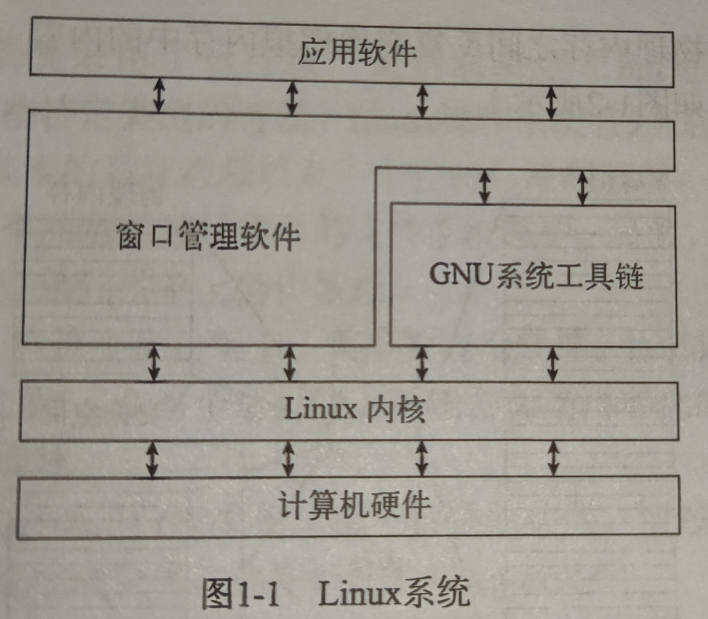

# 初识Linux

## 什么是Linux

Linux 可以分为四部分

+ Linux 内核
+ GNU工具
+ 图形化桌面
+ 应用软件

## 深入研究Linux内核

Linux系统的核心是内核

内核主要负责一下四种功能
+ 系统内存管理
+ 软件程序管理
+ 硬件设备管理
+ 文件系统管理

### 系统内存管理

交换空间: 内核通过硬盘上的存储空间来实现虚拟内存, 这块区域被称为交换空间

虚拟内存

页面: 内存存储单元按组划分成很多块, 这些块被称为页面

换出: 

### 软件程序管理

Linux操作系统将运行中的程序称为 `进程`

内核创建了第一个进程(称为 init 进程)来启动系统上所有其他进程, 这个表通常位于 `/etc/inittab` 中. 

在 Ubuntu 中则采用 `/etc/init.d` 目录, 将开启时启动或停止某个应用的脚本放在这个目录下. 这些脚本通过 `/etc/rcX.d` 目录下的入口启动. 这里X表示 `运行级`

