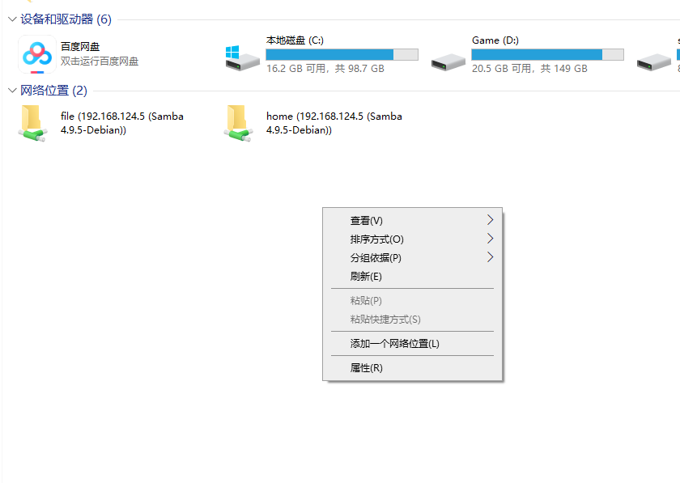
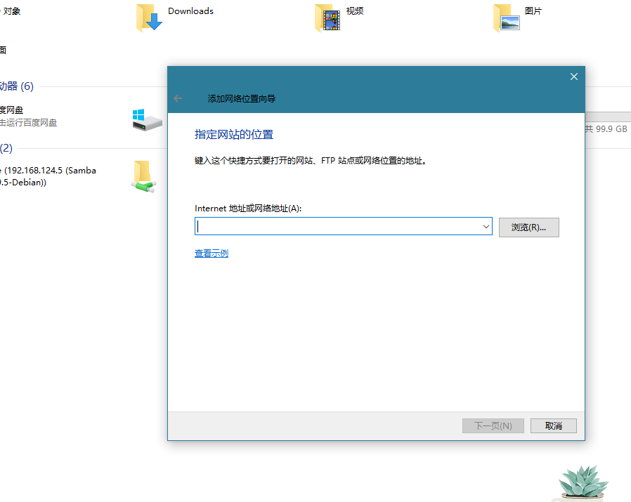

# deepin 文件共享

参考资料： https://www.cnblogs.com/shenwenbo/p/15030990.html

使用 samba

`sudo apt-get install samba`

编辑配置文件 `/etc/samba/smb.conf`


```conf
# 这个是全局设置， 保持原有的就行
[global]
   workgroup = WORKGROUP
   max log size = 1000
   logging = file
   panic action = /usr/share/samba/panic-action %d
   server role = standalone server
   obey pam restrictions = yes
   unix password sync = yes
   passwd program = /usr/bin/passwd %u
   passwd chat = *Enter\snew\s*\spassword:* %n\n *Retype\snew\s*\spassword:* %n\n *password\supdated\ssuccessfully* .
   pam password change = yes
   map to guest = bad user
   create mode = 0766
   force create mode = 0766
   directory mode = 0777
   force directory mode = 0777
   usershare allow guests = no

# 这个是需要的共享的设置
[home]
   # 这个随便写
   comment = ggbone home
   # 这个是共享地址
   path = /home/ggbone
   # 是否公开（谁都能访问）
   public = no
   # 是否可写
   writable = yes
   # 赋予创建权限
   create mask = 0777
   # 赋予删除权限
   directory mask = 0777
[file]
  comment = file disk
  path = /media/ggbone/My Passport
  public = no
  writable = yes
  create mask = 0777
  dirctory mask = 0777

```

我们可以直接使用deepin自身的账户就可， 不用新建账户

设置登录samba的账户
`sudo smbpasswd -a ggbone` 然后输入两次密码就可以了

> 如果要删除用户使用 `sudo smbpasswd -x ggbone`

启动服务
`sudo service smbd start`


设为开机启动
`sudo systemctl enable smbd`


## windows 链接linux目录

需要启动`SMB` 服务


可以选择映射驱动盘或者使用 `添加网络位置`功能





## 其他方式

还可以使用 nfs ， 但是不太好用（windows端会很卡， 而且还存在权限问题）