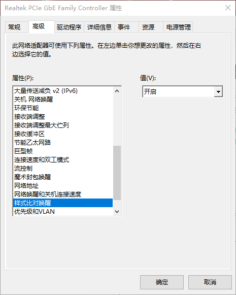
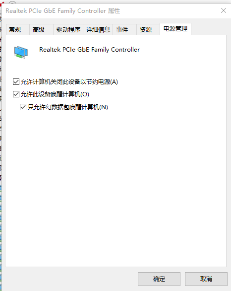

# 远程唤醒windows

## windows 设置

电源管理在关机选项中将`关机 网络唤醒` `魔术封包唤醒` `样式对比唤醒` 全部开启

然后在电源管理里面勾选`只允许幻数据包唤醒`, 防止电脑无故开机

## BIOS 设置

需要开启网络唤醒功能， 各个主板略有不同， 具体百度

## 获取windows机器的物理地址

## Linux 唤醒windows

`sudo apt-get install etherwake`

然后执行指令
`wakeonlan 2C:F0:5D:72:99:ED`

这样windows机器就会被唤醒了