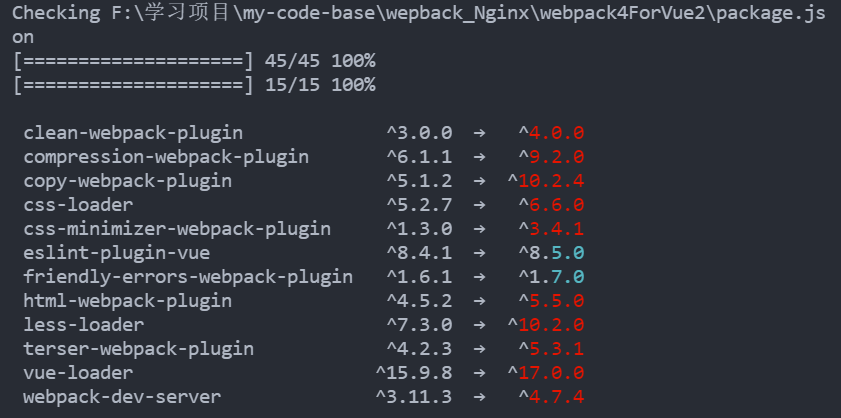
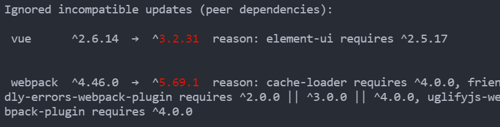
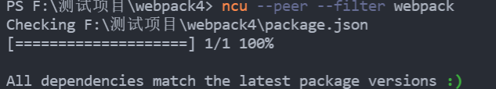

# 依赖更新检查

> npm i -g npm-check-updates

## 检查项目依赖是否有可用更新

> ncu

结果

## 检查依赖对是否允许更新

> ncu --peer

例如想更新 vue, 可以检查下依赖于 vue 的是否能够支持最新的 vue

上图显示了如果要更新 webpack, vue, 那么存在一些其他库将无法支持

**也可以单独对某一个包做检查**

> ncu --peer --filter webpack

