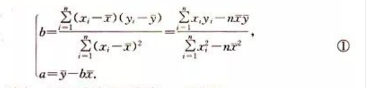

# 算法.统计.概率

算法: 通常是指可以用计算机来解决的某一类问题的程序或步骤, 这些程序或步骤必须是明确和有效的, 而且能够在有限步内完成.

`顺序结构` `条件结构` `循环结构`

进制数转换

## 统计

### 简单随机抽样

> 如果每次抽取时总体内的各个个体被抽取到的机会都相等, 就把这种抽样方法叫做简单随机抽样

- 抽签发
- 随机数法

### 系统抽样

简单随机抽样的优点时简单, 在个体数少的时候很方便.

但是个体数多了之后, 对个体的编号工作量大, 想要`搅拌均匀`也非常困难, 这就容易导致样本的代表性差. 为了在操作上方便快捷, 又不降低样本的代表性的前提下, 可以采用系统抽样方法

### 分层抽样

一般的, 在抽样时, 将总体分成互不交叉的层, 然后按照一定比例, 从各层独立地抽取一定数量的个体, 将各层取出的个体合在一起作为样本, 这种抽样方法就是分层抽样

## 用样本估计总体

- 用样本的频率分布估计总体的分布
- 用样本的数字特征估计总体的数字特征(如平均数, 标准差等)

- 中位数, 众数, 平均数
- 标准差: 是样本数据到平均数的一种平均距离

假设样本数据是 x1, x2, ..., xn, y 表示这组数据的平均数

则 S(标准差) = (|x1-y| + |x2-y| + ... |xn - y|) / n

由于绝对值不太好计算, 也可以

`S = √(1/n*[(x1-y)^2+ ... + (xn-y)^2])`

### 两个变量的线性相关

`散点图` `正相关` `负相关`

> 如果散点图中点的分布从整体上看大致在一条直线附近, 我们称这两个变量之间具有线性相关关系, 这条直线叫做`回归直线`

`y=bx+a`

其中

## 概率

### 随机事件的概率

- 极大似然法

如果我们面临的是从多个可选择答案中挑选正确答案的决策任务, 那么 "使得样本出现的可能性最大" 可以作为决策的准则

### 概率的基本性质

如果事件 A 和事件 B 互斥, 则 `P(A⋃B) = P(A) + P(B)`

## 古典概型

- 实验中所有可能出现的基本事件只有有限个
- 每个基本事件出现的可能性相等

具有这两个特点的概率模型称为 `古典概率模型`

## 几何概型

就是将概率转化为几何面积来计算

