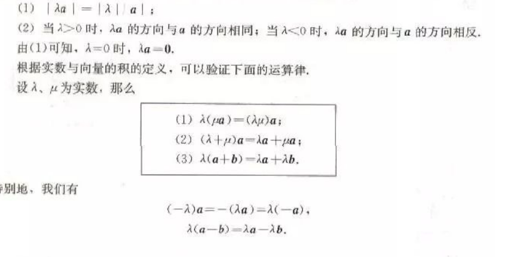
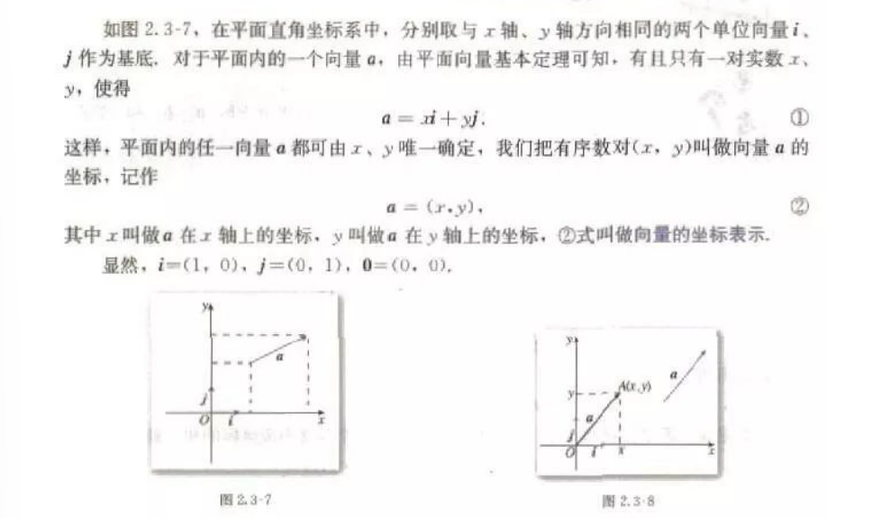

# 平面向量

## 平面向量的实际背景及基本概念

- 向量: 既有大小, 又有方向的量
- 有向线段: 带有方向的线段
- 模: 向量的长度
- 单位向量: 长度等于 1 个单位的单位

- 相等向量: 方向相同, 大小相等的向量
- 共线向量: 平行向量

## 向量加法运算及其几何意义

`a + b = AB-> + BC-> = AC->`

> 求两个向量的运算, 叫做向量的加法. 这种求向量和的方法, 称为向量加法的三角形法则.

## 向量减法及其几何意义

`a - b = AB-> - AC-> = BC->`

## 向量数乘运算及其几何意义

## 平面向量的基本定理及坐标表示

平面向量基本定理: 如果 e1, e2 是同一平面的两个不共线向量, 那么对于这一平面内的任意向量 ɑ, 有且只有一对实数 λ1, λ2, 使得: `ɑ = λ1e1 + λ2e2`

### 平面向量的正交分解及坐标表示

把一个向量分解为两个互相垂直的向量, 叫做把向量正交分解

在平面上, 如果选取互相垂直的向量作为基地时, 会为我们研究问题带来方便

### 平面向量的坐标运算

`a + b = (x1 + x2, y1 + y2)`
`a - b = (x1 - x2, y1 - y2)`
`λa = (λx1, λy1)`

> 一个向量的坐标等于表示此向量的有向线段的终点坐标减去始点的坐标

### 平面向量共线的坐标表示

`a = λb` ===> `x1y2 - x2y1 = 0`

## 平面向量的数量积

数量积 `a * b` 等于 `a` 的长度 |a| 与 b 在 a 方向的投影 |b|cosθ 的乘积

## 平面向量数量积的坐标表示, 模, 夹角

两个向量的数量积等于它们对应坐标的乘积和

`a*b = x1x2 + y1Y2`

所以 |a|^2 = x^2 + y^2

`cosθ = (a*b)/(|a|*|b|)`

