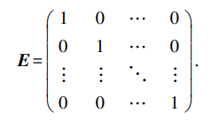
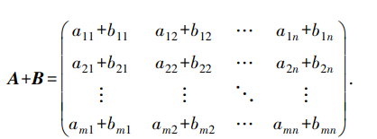
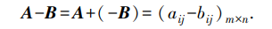
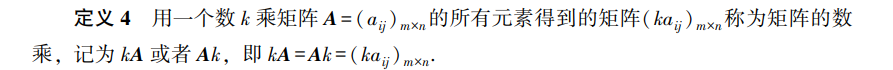
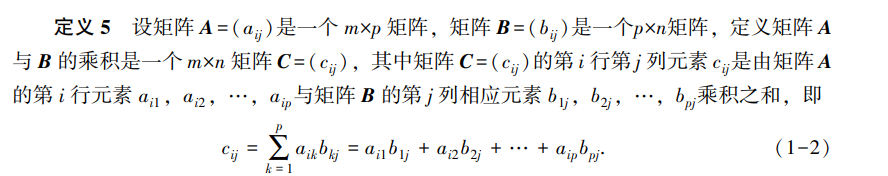
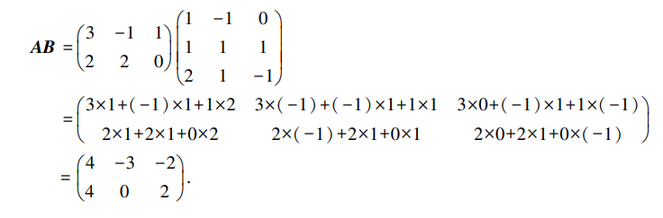
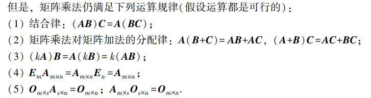
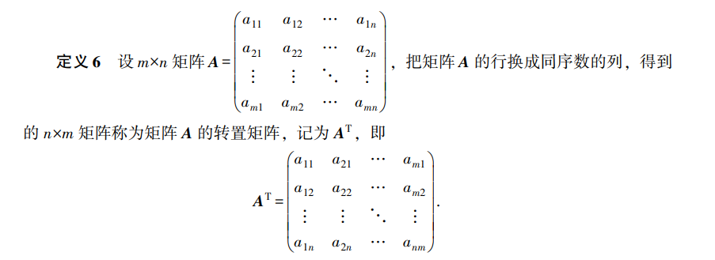
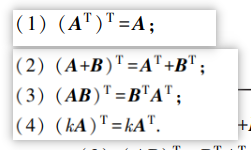

# 矩阵的概念及运算

> 线性方程组的求解是线性代数要研究的重要问题之一, 而矩阵是求解线性方程组的核心工具.

## 矩阵定义

> m \* n 个数排成 m 行 n 列的数表

行矩阵: 1\*n 的矩阵

列矩阵: n\*1 的矩阵

n 阶方阵: n\*n 的矩阵

下三角矩阵: n 阶方阵中, 当 `i<j` 时, `A[i, j] = 0`

上三角矩阵: n 阶方阵中, 当 `i>j` 时, `A[i, j] = 0`

对角阵`diag`: n 阶方阵中, 只有 `i==j` 是, `A[i, j]不为0`, 其余都为 0.

数量矩阵: 对角阵中, 不为 0 的元素全部相等( a1 == a2 == ... an)

n 阶单位矩阵(`E`): 数量矩阵中, 元素值为 1

同型矩阵: 两个矩阵的行数相等, 列数也相等.

> 判断两个矩阵是否相等: 1. 同型矩阵; 2. 每个元素相等

## 矩阵的线性运算

### 加法和减法

同型矩阵的加法就是对应位置元素相加或者相减

### 数乘

一个数乘以一个矩阵, 就是乘以矩阵中的每个元素

## 矩阵乘法

1. 举证乘法不满足交换律, 即 `AB != BA`
2. A 与 B 满足 AB=0, 不能得出 A=0 或者 B=0

## 矩阵的转置

> 把 m\*n 的矩阵 A, 转换成同序数的列, 得到 n\*m 的矩阵 A 的转置矩阵

运算规律:

## 分块矩阵

可以将一个行数和列数较高的矩阵， 用一些横线和竖线分隔为若干个小矩阵。

每个小矩阵的运算和普通矩阵的运算相同

