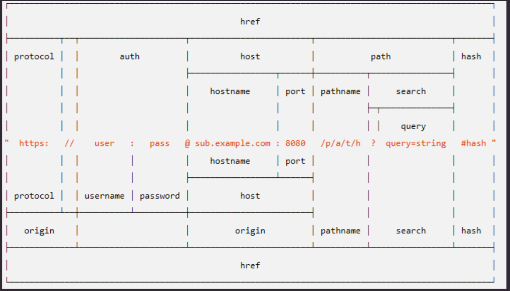

# 网络基础

[toc]

## OSI (开放系统互联基本参考模型)

+ 应用层
+ 会话层
+ 表示层
+ 传输层
+ 网络层
+ 数据链路层
+ 物理层

## 工业标准的网络模型

+ 应用层
+ 传输层
+ 网络层
+ 数据链路层

## 统一资源标识符

## 网络通信协议

### 应用层

#### HTTP

Hyper Text Transfer Protocol 超文本传输协议

用于从万维网服务器传输超文本到本地浏览器的传送协议

超文本就是可以超链接的文档

特点
1. 快速, 灵活, 允许传输任意类型数据对象
2. 基于请求/响应模式, 无连接, 服务器响应之后连接就结束了

默认端口 80

基于SSL加密的 HTTPS 默认端口是 443

#### FTP

File Transfer Protocol 文件传输协议

端口 20 用于控制
端口 21 用于传输

#### SMTP

电子邮件传输协议

默认端口 25

#### Telnet

远程管理

端口 23

#### DNS

#### SSH

安全外壳协议, 转为远程登录会话和其他网路服务提供安全协议

端口 22

### 传输层

#### TCP

#### UDP

无需建立连接就可以发送报文

### 网络层

#### IP

网际互连协议

IP地址数字范围是 0-255, 不能是255

#### ICMP

报文控制协议

#### ARP & RARP